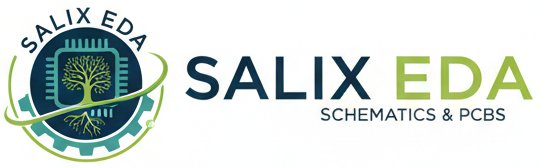

# SalixEDA

SalixEDA - это кроссплатформенная самостоятельная EDA-система для разработки схем и печатных плат.

Проект разрабатывается с 1997 года и ориентирован на создание встроенной и промышленной электроники средней сложности.

Также подходит для студентов и любителей за счет интегрированности и низкого порога входа.

Ключевая особенность - проектно-ориентированная архитектура:

- полностью самодостаточный один файл проекта

- замороженные версии компонентов внутри проекта

- автоматическая связь схема-плата

Оригинальная и современная система управления библиотеками компонентов. 

# Key Features

## 1. Single-file Project Model

- Схема, плата, компоненты и 3D модели находятся в едином файле проекта

- Проект легко переносится копирование одного файла

- Компоненты "замораживаются" внутри проекта и на них не оказывают влияния последующие внешние изменения в библиотеках

## 2. Immutable Component Versions

- Изменения в библиотеке не ломают старые проекты

- Компоненты, имеющие в библиотеках более новые версии подсвечиваются в проекте и могут быть обновлены вручную

- Конфликты возникающие при обновлении контролируются пользователем

## 3. Distributed Component Library

- Локальная библиотека автоматически пополняется при открытии проектов

- Глобальная публичная библиотека доступна любому пользователю. Она пополняется авторами на добровольной основе. Синхронизация локальной библиотеки и глобальной публичной осуществляется автоматически в фоновом режиме. Это позволяет быть уверенным в самом актуальном состоянии своих библиотек

- Для распределенной и командной работы каждому пользователю предоставляется приватное облако. В него размещаются все компоненты не попавшие в публичную библиотеку. Синхронизация с приватным облаком выполняется автоматически

- Авторы компонентов криптографически подписывают свои работы. Имеется рейтинг авторов по количеству и качеству созданных компонентов

## 4. Built-in 3D Editor

- Параметрический 3D-редактор на встроенном скриптовом языке, позволяющий в текстовом виде описать геометрию. Такой подход значительно упрощает создание моделей за счет повторного использования фрагментов скрипта

- Импорт VRML и STL

## 5. Manufacturing Ready

- Экспорт Greber из коробки

# Comparison

| Feature                      | SalixEda       | KiCad   |
| ---------------------------- |:--------------:|:-------:|
| Single-file project          | ✓              | ✗       |
| Immutable component versions | ✓              | Partial |
| Real-time schematic-PCB sync | ✓              | Manual  |
| Auto-router                  | Auto completer | ✓       |
| Impedance control            | ✗              | ✓       |
| Hierarchical design          | ✗              | ✓       |

SalixEDA ориентирован на embedded и промышленную электронику, а не на высокочастотную или высокоинтегрированную электронику типа IPhone.

# Screenshots

# Download

Готовые сборки доступны на сайте [SalixEDA.org/download](https://www.salixeda.org/download)

Поддерживаемые платформы

- Windows не хуже 8

- Linux (Mint, Ubuntu)

# Build from source

SalixEDA написан с C++ 20. В качестве фреймворка используется Qt6. Разработка и сборка ведется с использованием QtCreator. 

Клонируйте проект с помощью git или zip в отдельный каталог. Из QtCreator откройте файл проекта SalixEDA.pro. Выберите в QtCreator команду "Собрать".

# Documentation

# Contributing

# Third-party licenses

- Qt6 - LGPL

SalixEDA is a cross-platform EDA/CAD tool for electronic design automation. Developed since 1997, it offers robust schematic capture, PCB layout, and library management suitable for hobbyists, students, and professionals. Built on modern Qt6 framework.
