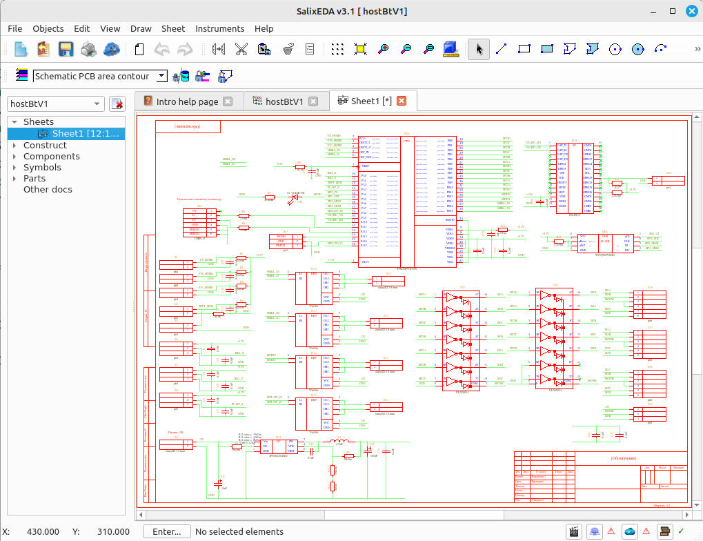
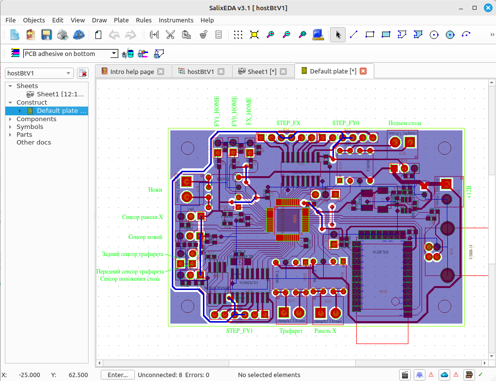
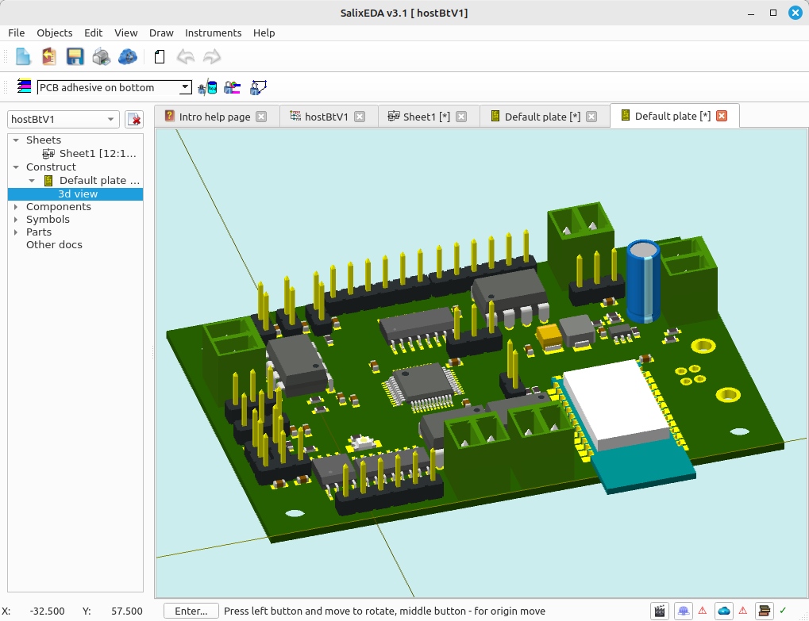

# SalixEDA

Russian version: [README.ru.md](README.ru.md)


[](LICENSE)
[](https://www.qt.io)
[]()

SalixEDA is a cross-platform, standalone EDA system for schematic capture and PCB design.

Developed continuously since 1997, the project focuses on embedded and industrial electronics of moderate complexity. It is equally suitable for students and hobbyists thanks to its integrated workflow and low learning curve.

The key differentiator is a **project-centric architecture**:

- Fully self-contained single-file projects
- Frozen component versions within each project
- Automatic schematic-to-PCB synchronization

A modern, original component library management system.

Built with C++20 and Qt6 framework.

---

# Key Features

## 1. Single-file Project Model

- Schematics, PCB layout, components, and 3D models are stored in one file
- Projects are easily shared by copying a single file
- Components are "frozen" inside the project, unaffected by external library changes

## 2. Immutable Component Versions
- Library updates never break legacy projects
- Components with newer library versions are highlighted for optional manual updates
- Controlled conflict resolution during updates

## 3. Distributed Component Library
- Local library automatically populated from components used in opened projects
- Global public library available to all users, contributed voluntarily by authors. Background synchronization keeps local libraries up-to-date
- Private cloud for distributed and team workflows hosts components not suitable for public library, with automatic synchronization
- Cryptographic signing of components with author ratings based on quantity and quality

## 4. Built-in 3D Editor
- Parametric 3D editor using an embedded scripting language for text-based geometry description. This approach simplifies model creation through reusable script fragments
- Import support for VRML and STL formats

## 5. Manufacturing Ready
- Built-in Gerber export
- Pick-and-place machine data export

---

# Comparison

| Feature                      | SalixEda       | KiCad   |
| ---------------------------- |:--------------:|:-------:|
| Single-file project          | ✓              | ✗       |
| Immutable component versions | ✓              | ⚠ Partial |
| Real-time schematic-PCB sync | ✓              | Manual  |
| Auto-router                  | Auto completer | ✓       |
| Impedance control            | ✗              | ✓       |
| Hierarchical design          | ✗              | ✓       |

SalixEDA is optimized for embedded and industrial electronics, not for high-frequency or highly integrated designs (e.g., smartphone motherboards).

---

# Screenshots

Schematic




Pcb




Pcb as 3d view



---

# Download

Pre-built packages are available at [SalixEDA.org/download](https://www.salixeda.org/download)

**Supported platforms:**
- Windows 10 or newer (Windows 8 may work but is not officially supported)
- Linux (Mint, Ubuntu, and most modern distributions)

---

# Build from source

SalixEDA is written in C++20 and uses Qt6 as its framework. Development and builds are typically done using QtCreator.

```bash
# Clone the repository
git clone https://github.com/SalixEDA/SalixEDA.git
```

1. Open `SalixEDA.pro` in QtCreator
2. Select the "Build" command
3. The project is self-contained and requires no external dependencies beyond Qt6 itself

---

# Documentation

Documentation is currently under preparation.

Planned sections:

**For end users:**
- Quick start guide
- User manual

**For developers:**
- Architecture overview
- File format description

Basic usage information will appear here soon.

---

# Contributing

Contributions are welcome.

Please open an issue before submitting pull requests so that changes can be discussed.

Developer documentation is currently under preparation.

---

# License

SalixEDA is open-source software. The core application is licensed under the [GNU General Public License v3.0](LICENSE).

## Third-Party Licenses
- Qt6 framework is used under the [LGPL](https://doc.qt.io/qt-6/lgpl.html)

---

## 📬 Contact & Community

- **Website:** [salixeda.org](https://salixeda.org)
- **Issues:** [GitHub Issues](https://github.com/SalixEDA/SalixEDA/issues)
