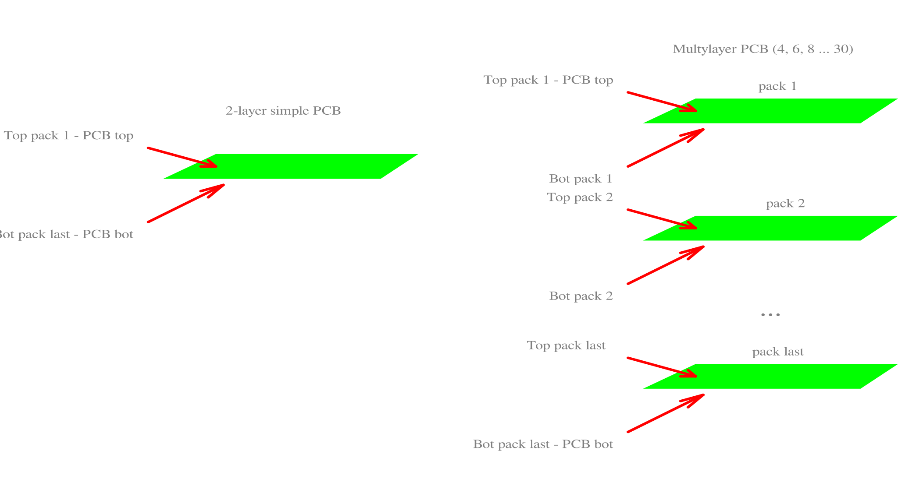

# PCB Layers

The [layer](layers.htm) system of the SalixEDA graphical editors is simply a way to group graphical objects. For example, in the schematic editor there is a Component layer. It is intended for drawing component symbols.

Graphical [layers](layers.htm) exist in all SalixEDA graphical editors, including the PCB editor.

On the other hand, for a printed circuit board, there is its own concept of a layer. This article describes the relationship between PCB layers and graphical editor layers.

Typically, printed circuit boards are divided into single-sided (single-layer), double-sided (double-layer) and multi-layer. The difference lies in the number of physical layers with copper traces and pads.

For a single-sided board, all copper traces and pads are located on one side. This is the simplest PCB that can be manufactured even at home.

For double-sided boards, traces and pads can be located on both sides of the PCB. Here, the need arises to transition traces from one side of the board to the other. This is done using vias. Typically, all holes in a double-sided PCB (except for mounting holes, and even then not always) have a conductive layer on the hole walls. This layer provides electrical connection between the top and bottom of the PCB.

A multi-layer PCB is a stack of double-sided board layers (cores). Vias in multi-layer PCBs come in two types: through vias and blind/buried vias. Through vias pass through the entire PCB (through all cores) and connect all cores together. Blind/buried vias are made locally in each core and serve for transitioning between the top and bottom of a specific core. Thus, you can transition from layer to layer within a single core. If you need to transition between cores, you must use a through via, which will connect all layers of all cores.

The SalixEDA system uses the following terminology: **pack** means one board core. A double-sided or single-sided board has one pack, which is also the board itself. There is no special designation for a single-sided board. It is essentially a double-sided board that actually uses only one layer (top or bottom) and has no vias. A multi-layer board consists of two or more packs. The SalixEDA system supports 15 packs (30 layers). The topmost pack is Pack 1. The bottommost pack is the last pack. Therefore, for a 4-layer board, there will be Pack 1 and the last pack. For a 6-layer board — Pack 1, Pack 2, and the last pack. And so on.

The SalixEDA system groups graphical layers by physical board layers. Components can be located on both the top and bottom sides of the board. Therefore, in the "top of pack 1" group, there are layers for components (for drawing component footprints), pads, names and numbers of pads, solder paste, glue, etc. A similar set exists for the "bottom of last pack".

For routing objects, SalixEDA offers separate graphical layers: pads, traces, polygons, keepouts. This set exists for each physical PCB layer (top and bottom for each pack).
