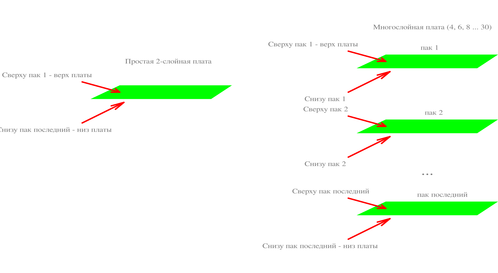

# Слои печатной платы
Система [слоев](layers.htm) графических редакторов SalixEDA - это просто способ группировки графических
объектов. Например, в схемном редакторе есть слой Компонент. Он предназначен для рисования
схемного обозначения компонентов.

Графические [слои](layers.htm) есть во всех графических редакторах SalixEDA, в том числе и в редакторе
печатных плат.

С другой стороны для печатной платы есть свое понятие слоя. В этой статье описана
взаимосвязь слоев печатной платы и слоев графических редакторов.

Обычно, печатные платы подразделяются на односторонние (однослойные), двухсторонние (двухслойные)
и многослойные. Отличие заключается в количестве физических слоев с печатными дорожками
и площадками. 

У односторонней платы все печатные дорожки и площадки расположены с
одной стороны. Это самая простая печатная плата, которая может быть изготовлена даже
в домашних условиях. 

У двухсторонних плат дорожки и площадки могут быть расположены с обеих
сторон печатной платы. Здесь появляется необходимость перехода дорожек с одной стороны
платы на другую. Это делается с помощью переходных отверстий. Обычно все отверстия
двухсторонней печатной платы (за исключением крепежных, да и то не всегда) имеют на стенках
отверстия проводящий слой. Этот слой обеспечивает связь между верхом и низом печатной
платы.

Многослойная печатная плата - это пирог из двухсторонних плат-пластин. Переходные
отверстия у многослойных печатных плат бывают двух типов: сквозные и межслойные (глухие).
Сквозные переходные отверстия проходят сквозь всю печатную плату (через все платы-пластины)
и соединяют все пластины между собой. Глухие переходные отверстия делаются локально
в каждой плате-пластине и служат для перехода между верхом и низом конкретной пластины.
Таким образом, можно переходить со слоя на слой в пределах одной пластины. А если
нужно перейти между пластинами, то необходимо использовать сквозное переходное отверстие,
которое соединит все слои всех пластин.

В системе SalixEDA используется следующая терминология: **пак** - означает одну плату-пластину.
Двухсторонняя и односторонняя платы имеют один пак, он же является платой. Для односторонней
платы нету специального обозначения. Это двухсторонняя плата, в которой фактически
используется только один слой (верхний или нижний) и отсутствуют переходные отверстия.
Многослойная плата состоит из двух и более паков. Система SalixEDA поддерживает 15
паков (30 слоев). Самый верхний пак - это пак 1. Самый нижний - это пак последний.
Поэтому, для 4-слойной платы будет пак 1 и пак последний. Для 6-слойной - пак 1, пак
2, пак последний. И т.д.

Система SalixEDA  группирует графические слои по физическим слоям платы. Компоненты 
могут располагаться на верхней и на нижней сторонах платы. Поэтому в группе "сверху
пак 1" есть слои для компонентов (для изображения корпусов компонентов), ножек, имен и номеров
ножек, трафарета, клея и т.п. Аналогичный комплект есть и для "снизу пак последний".

Для трассировочных объектов система SalixEDA предлагает отдельные графические слои:
площадки (для отображения площадок), дорожки, полигоны, запреты. Такой набор есть
для каждого физического слоя печатной платы (сверху и снизу для каждого пака).
