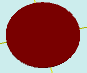

# flatCircle

[Содержание](contents.htm)=>[Скрипт 3d](script3d.md)=>[Построение 3d моделей](script2Root.md)

---

## Формат вызова
`flat flatCircle( float radius )`

## Описание
Формирует 2D контур (проекцию) окружности. Подобно другим функциям формирования контуров
на основе кривых линий, окружность формируется как полигон из 30 сегментов. Если необходимо
другое количество сегментов, то можно воспользоваться функцией формирования 
[эллипса](scriptFunFlatEllipse.md),
задав одинаковые радиусы по обеим осям.

## Параметры
- radius - радиус окружности

## Пример использования

```
f = flatCircle( 5 )

body = solidNew( f, 0.2, true )
partModel = modelSolid( selectColor("#800000"), body, 0,0,0, 0,0,0 )
```

Этот код сформирует такое изображение:


