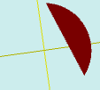

# flatCircularSegment

[Содержание](contents.htm)=>[Скрипт 3d](script3d.md)=>[Построение 3d моделей](script2Root.md)

---

## Формат вызова
`flat flatCircularSegment( float radius, float angleStart, float angleStop )`

## Описание
Формирует 2D контур (проекцию) сегмента окружности. Окружность разворачивается по
часовой стрелке от начального угла до конечного.

## Параметры
- radius - радиус окружности
- angleStart - угол начала сегмента
- angleStop - угол конца сегмента

## Пример использования

```
f = flatCircularSegment(  5, 10, 130 )

body = solidNew( f, 0.2, true )
partModel = modelSolid( selectColor("#800000"), body, 0,0,0, 0,0,0 )
```

Этот код сформирует такое изображение:


