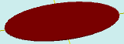

# flatEllipse

[Contents](contents.htm)=>[3D Script](script3d.md)=>[Building 3D models](script2Root.md)

---

## Call format
`flat flatEllipse( float radiusx, float radiusy, float stepDegree )`

## Description
Creates a 2D contour (projection) of an ellipse.

## Parameters
- radiusx - radius of the ellipse along the X axis
- radiusy - radius of the ellipse along the Y axis
- stepDegree - the ellipse is formed by a polygon; this parameter sets the angle step in degrees between the vertices of this polygon

## Usage example

```
f = flatEllipse( 10, 5, 12 )

body = solidNew( f, 0.2, true )
partModel = modelSolid( selectColor("#800000"), body, 0,0,0, 0,0,0 )
```

This code generates the following image:


