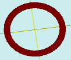

# flatEquidistant

[Содержание](contents.htm)=>[Скрипт 3d](script3d.md)=>[Построение 3d моделей](script2Root.md)

---

## Формат вызова
`flat flatEquidistant( flat profile, float distance )`

## Описание
Формирует 2D контур эквидистантный к исходному контуру. Дистанция между контурами
задается числом. Если число положительное, то эквидистантный контур - внутри исходного,
если число отрицательное - снаружи.

## Параметры
- profile - исходный контур
- distance - дистанция до эквидистантного контура

## Пример использования

```
f = flatCircle( 5 )
fe = flatEquidistant( f, 1 )

body = solidTubeDif( f, fe, 0.2, true )
partModel = modelSolid( selectColor("#800000"), body, 0,0,0, 0,0,0 )
```

Этот код сформирует такое изображение:


