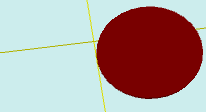

# flatOffset

[Contents](contents.htm)=>[3D Script](script3d.md)=>[Building 3D models](script2Root.md)

---

## Call format
`flat flatOffset( flat profile, float offsetX, float offsetY )`

## Description
All contour generation functions perform constructions relative to the center.
Therefore, the geometric center of the shape will be at the point 0,0.
This function allows you to shift the center of the contour construction,
displacing it on the plane.

## Parameters
- profile - original contour
- offsetX - offset along the X axis
- offsetY - offset along the Y axis

## Usage example

```
f = flatCircle( 5 )
f = flatOffset( f, 5, -2 )

body = solidNew( f, 0.2, true )
partModel = modelSolid( selectColor("#800000"), body, 0,0,0, 0,0,0 )
```

This code generates the following image:


