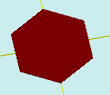

# flatPlygedronInner

[Contents](contents.htm)=>[3D Script](script3d.md)=>[Building 3D models](script2Root.md)

---

## Call format
`flat flatPlygedronInner( float radius, float sideCount )`

## Description
Creates a 2D contour (projection) of a regular polygon specified by an inscribed circle.

## Parameters
- radius - radius of the inscribed circle (distance from the center to a side)
- sideCount - number of sides of the regular polygon, must be three or more

## Usage example

```
f = flatPlygedronInner(  5, 6 )

body = solidNew( f, 0.2, true )
partModel = modelSolid( selectColor("#800000"), body, 0,0,0, 0,0,0 )
```

This code generates the following image:


