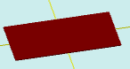

# flatRectangle

[Contents](contents.htm)=>[3D Script](script3d.md)=>[Building 3D Models](script2Root.md)

---

## Call Format
`flat flatRectangle( float length, float width )`

## Description
Creates a 2D contour (projection) of a rectangle.

## Parameters
- length - rectangle length (X)
- width - rectangle width (Y)

## Usage Example

```
f = flatRectangle( 10, 5 )

body = solidNew( f, 0.2, true )
partModel = modelSolid( selectColor("#800000"), body, 0,0,0, 0,0,0 )
```


This code will generate the following image:



