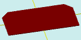

# flatRectangleBevel

[Contents](contents.htm)=>[3D Script](script3d.md)=>[Building 3D models](script2Root.md)

---

## Call format
`flat flatRectangleBevel( float lenght, float width, float bevelSize, float count )`

## Description
Creates a 2D contour (projection) of a rectangle with beveled corners. The size
of the bevel and the number of beveled corners are configurable.

## Parameters
- lenght - length of the rectangle (X)
- width - width of the rectangle (Y)
- bevelSize - size of the bevel
- count - number of beveled corners, from 1 to 4

## Usage example

```
f = flatRectangleBevel( 10, 5, 1, 2 )

body = solidNew( f, 0.2, true )
partModel = modelSolid( selectColor("#800000"), body, 0,0,0, 0,0,0 )
```

This code generates the following image:


