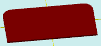

# flatRectangleRound

[Содержание](contents.htm)=>[Скрипт 3d](script3d.md)=>[Построение 3d моделей](script2Root.md)

---

## Формат вызова
`flat flatRectangleRound( float lenght, float width, float radius, float stepDegree, float count )`

## Описание
Формирует 2D контур (проекцию) прямоугольника со скругленными углами. Радиус скругления и
количество скошенных углов - задаются.

## Параметры
- lenght - длина прямоугольника (X)
- width - ширина прямоугольника (Y)
- radius - радиус скругления
- stepDegree - скругления образуются ломаной линией, этот параметр задает шаг в градусах
между вершинами этой ломаной линии
- count - количество скругленных углов 1-4

## Пример использования

```
f = flatRectangleRound( 10, 5, 1, 15, 2 )

body = solidNew( f, 0.2, true )
partModel = modelSolid( selectColor("#800000"), body, 0,0,0, 0,0,0 )
```

Этот код сформирует такое изображение:


