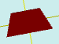

# flatTrapezoid

[Contents](contents.htm)=>[3D Script](script3d.md)=>[Building 3D models](script2Root.md)

---

## Call format
`flat flatTrapezoid( float lenghtTop, float lenghtBot, float width )`

## Description
Creates a 2D contour (projection) of a trapezoid.

## Parameters
- lenghtTop - length of the top base
- lenghtBot - length of the bottom base
- width - height of the trapezoid

## Usage example

```
f = flatTrapezoid(  3, 6, 2 )

body = solidNew( f, 0.2, true )
partModel = modelSolid( selectColor("#800000"), body, 0,0,0, 0,0,0 )
```

This code generates the following image:


