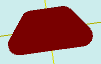

# flatTrapezoidRound

[Содержание](contents.htm)=>[Скрипт 3d](script3d.md)=>[Построение 3d моделей](script2Root.md)

---

## Формат вызова
`flat flatTrapezoidRound( float lenghtTop, float lenghtBot, float width, float radius )`

## Описание
Формирует 2D контур (проекцию) трапеции со скругленными углами.

## Параметры
- lenghtTop - длина верхнего основания
- lenghtBot - длина нижнего основания
- width - высота трапеции
- radius - радиус скругления углов

## Пример использования

```
f = flatTrapezoidRound(  5, 8, 4, 1 )

body = solidNew( f, 0.2, true )
partModel = modelSolid( selectColor("#800000"), body, 0,0,0, 0,0,0 )
```

Этот код сформирует такое изображение:


