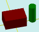

# modelSolidAdd

[Contents](contents.htm)=>[3D Script](script3d.md)=>[Building 3D models](script2Root.md)

---

## Call format
`model modelSolidAdd( model src, color bodyColor, faceList faces )`

## Description
Adds an additional body with an arbitrary color to the model. The orientation and position of the additional body in space are determined by the model.

## Parameters
- src - original model
- bodyColor - color of the body
- faces - the body obtained by one or more solidXXX functions

## Usage example

```
body = solidBox( 6, 4, 3, true )

md = modelSolid( selectColor("#800000"), body, 0,0,0, 0,0,0 )

body = solidNew( flatOffset( flatCircle(1), 5, 0 ), 5, true )

partModel = modelSolidAdd( md, selectColor("#008000"), body )
```

This code generates the following image:


