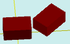

# modelSolidCopy

[Содержание](contents.htm)=>[Скрипт 3d](script3d.md)=>[Построение 3d моделей](script2Root.md)

---

## Формат вызова
`model modelSolidCopy( model src, float angX, float angY, float angZ, float offX, float offY, float offZ )`

## Описание
Создает копию модели с новой ориентацией и положением.

Копирование модели - это основной принцип формирования нескольких однотипных ножек компонентов.

## Параметры
- src исходная модель
- angX, angY, angZ углы поворота соответственно вокруг осей X, Y и Z в градусах. Поворот
выполняется последовательно: сначала по X, затем - по Y и, наконец, - по Z
- offX, offY, offZ смещение тела в пространстве


## Пример использования

```
body = solidBox( 6, 4, 3, true )

md = modelSolid( selectColor("#800000"), body, 0,0,0, 0,0,0 )

partModel = modelSolidCopy( md, 0,0,45,   7, 2, 0 )
```

Этот код сформирует такое изображение:


