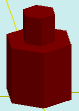

# solidAdd

[Contents](contents.htm)=>[3D Script](script3d.md)=>[Building 3D models](script2Root.md)

---

## Call format
`faceList solidAdd( faceList solid, float thickness, float height, float offset )`

## Description
Adds an extension onto the last face of the shape, using the profile of that last face.

The last face is typically the top one, but not always. For example, in a cup or a glass, it is the bottom of the inner surface.

## Parameters
- solid - original shape
- thickness - the distance from the profile of the last face to the profile of the extension. Positive numbers make the extension smaller than the last face, negative numbers make it larger
- height - height of the extension. Positive numbers create an extension, negative numbers create a cup-like hollow
- offset - offset of the extension's start (or the inner part of the cup) along the normal to the last surface

## Usage example

```
body = solidPlygedronInner( 2, 4, 6, true )

body = solidAdd( body, 1, 2, 0 )

partModel = modelSolid( selectColor("#800000"), body, 0,0,0, 0,0,0 )
```

This code generates the following image:



