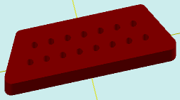

# solidAddBlindArray

[Contents](contents.htm)=>[3D Script](script3d.md)=>[Building 3D models](script2Root.md)

---

## Call format
`faceList solidAddBlindArray( faceList solid, flat holeProfile, float depth, floatList groups[horzDist, count, horzOffset, vertOffset...] )`

## Description
Adds an array of blind holes to the last face of the shape. The array consists of groups of holes arranged in a row. Each group is described by four numbers in the `groups` parameter.

The last face is typically the top one, but not always. For example, in a cup or a glass, it is the bottom of the inner surface.

## Parameters
- solid - original shape
- holeProfile - profile of a single hole in the array. All profiles in the array must be completely inside the profile of the last face
- depth - depth of the hole. Positive numbers create a hole with a bottom, negative numbers create a protruding extension
- groups - array of group descriptions

## Group description block
Horizontally, the group is aligned to its own center, and an offset is added to this center, allowing the group to be placed anywhere.

Each group is described by four numbers. The number of quadruplets determines the number of groups. Two or more groups can form a single row thanks to the `vertOffset` parameter.

- horzDist - horizontal distance between holes
- count - number of holes in the group. All holes in the group are arranged horizontally in a row
- horzOffset - the group is aligned by its horizontal center. This offset allows shifting the group horizontally relative to the horizontal center
- vertOffset - vertical offset of the group. Essentially, the vertical position of the group

## Usage example

```
body = solidTrapezoidRound( 20, 26, 8, 5, 1, true )

hole = flatCircle( 0.5 )

body = solidAddBlindArray( body, hole, 3, [ 2.5, 7, 0, 1.25,
                                            2.5, 8, 0, -1.25] )

partModel = modelSolid( selectColor("#800000"), body, 0,0,0, 0,0,0 )
```

This code generates the following image:



