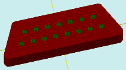

# solidAddBlindArrayColor

[Содержание](contents.htm)=>[Скрипт 3d](script3d.md)=>[Построение 3d моделей](script2Root.md)

---

## Формат вызова
`faceList solidAddBlindArrayColor( faceList solid, flat holeProfile, float depth, floatList groups[horzDist, count, horzOffset, vertOffset...], color bodyColor )`

## Описание
Добавляет на последнюю грань фигуры массив глухих отверстий. Массив состоит из групп
отверстий с произвольным цветом, расположенных в ряд. Каждая группа описывается в четырьмя числами в параметре
groups.

Последняя грань обычно верхняя, но далеко не всегда. Например, у стакана это дно внутренней
поверхности стакана.

## Параметры
- solid исходная фигура
- holeProfile профиль одного отверстия массива. Все профили массива должны быть полностью
внутри профиля последней грани
- depth глубина отверстия. С положительными числами получается отверстие с дном, с 
отрицательными - торчащая надстройка
- groups массив описаний групп
- bodyColor цвет внутренней части отверстий


## Блок описания группы
По горизонтали группа выравнивается по своему центру, плюс к этому центру добавляется
смещение, что позволяет разместить группу в любом месте.

Каждая группа описывается четырьмя числами. Количество четверок определяет количество
групп. Две и более группы могут составлять один ряд благодаря параметру vertOffset.

- horzDist расстояние между отверстиями по горизонтали
- count количество отверстий в группе. Все отверстия группы располагаются в ряд по
горизонтали
- horzOffset группа выравнивается по горизонтальному центру группы. Это смещение позволяет
сместить группу по горизонтали относительно горизонтального центра
- vertOffset смещение группы по вертикали. По сути позиция группы по вертикали


## Пример использования

```
body = solidTrapezoidRound( 20, 26, 8, 5, 1, true )

hole = flatCircle( 0.5 )

body = solidAddBlindArrayColor( body, hole, 3, [ 2.5, 7, 0, 1.25,
                                                 2.5, 8, 0, -1.25], selectColor("#008000") )

partModel = modelSolid( selectColor("#800000"), body, 0,0,0, 0,0,0 )
```

Этот код сформирует такое изображение:



