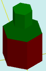

# solidAddColor

[Содержание](contents.htm)=>[Скрипт 3d](script3d.md)=>[Построение 3d моделей](script2Root.md)

---

## Формат вызова
`faceList solidAddColor( faceList solid, float thickness, float height, float offset, color bodyColor )`

## Описание
Добавляет на последнюю грань фигуры надстройку с профилем последней грани и с произвольным
цветом.

Последняя грань обычно верхняя, но далеко не всегда. Например, у стакана это дно внутренней
поверхности стакана.

## Параметры
- solid исходная фигура
- thickness расстояние от профиля последней грани до профиля надстройки. Положительные
числа делают надстройку меньше, чем последняя грань, отрицательные - больше
- height высота надстройки. С положительными числами получается надстройка, с 
отрицательными - стакан
- offset смещение начала надстройки (или внутренней части стакана) по нормали к последней
поверхности
- bodyColor цвет надстройки

## Пример использования

```
body = solidPlygedronInner( 2, 4, 6, true )

body = solidAddColor( body, 1, 2, 1,  selectColor("#008000") )

partModel = modelSolid( selectColor("#800000"), body, 0,0,0, 0,0,0 )
```

Этот код сформирует такое изображение:



