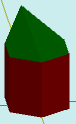

# solidAddConeColor

[Содержание](contents.htm)=>[Скрипт 3d](script3d.md)=>[Построение 3d моделей](script2Root.md)

---

## Формат вызова
`faceList solidAddConeColor( faceList solid, float coneHeight, float offx, float offy, color coneColor )`

## Описание
Добавляет на последнюю грань фигуры конус произвольного цвета с возможностью смещения
вершины от центра.

Последняя грань обычно верхняя, но далеко не всегда. Например, у стакана это дно внутренней
поверхности стакана.

## Параметры
- solid исходная фигура
- coneHeight высота конуса. Положительные числа - конус имеет форму крыши, отрицательные
числа - конус имеет форму впадины
- offx смещение по X вершины конуса по плоскости последней грани исходной фигуры
- offy смещение по Y вершины конуса по плоскости последней грани исходной фигуры
- coneColor цвет конуса

## Пример использования

```
body = solidPlygedronInner( 2, 4, 6, true )

body = solidAddConeColor( body, 3, -1,0.5,  selectColor("#008000") )

partModel = modelSolid( selectColor("#800000"), body, 0,0,0, 0,0,0 )
```

Этот код сформирует такое изображение:



