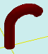

# solidAddCurveXZ

[Содержание](contents.htm)=>[Скрипт 3d](script3d.md)=>[Построение 3d моделей](script2Root.md)

---

## Формат вызова
`faceList solidAddCurveXZ( faceList solid, float radius, int sideCount, float curveAngle )`

## Описание
Продлевает тело с последней грани выполняя поворот в плоскости XZ (вокруг оси Y).

Последняя грань обычно верхняя, но далеко не всегда. Например, у стакана это дно внутренней
поверхности стакана.

## Параметры
- solid исходная фигура
- radius радиус изгиба
- sideCount изгиб интерполируется кусочной линией. Этот параметр показывает на сколько
кусочков нужно разделить изгиб
- curveAngle угол поворота в градусах. Положительные числа - показывают поворот по часовой стреке,
отрицательные - против часовой стрелки


## Пример использования

```
body = solidCylinder( 1, 5, true )

body = solidAddCurveXZ( body, 3, 12, 150 )

partModel = modelSolid( selectColor("#800000"), body, 0,0,0, 0,0,0 )
```

Этот код сформирует такое изображение:



