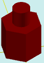

# solidAddDif

[Содержание](contents.htm)=>[Скрипт 3d](script3d.md)=>[Построение 3d моделей](script2Root.md)

---

## Формат вызова
`faceList solidAddDif( faceList solid, flat profile, float height, float offset )`

## Описание
Добавляет на последнюю грань фигуры надстройку с произвольным профилем.

Последняя грань обычно верхняя, но далеко не всегда. Например, у стакана это дно внутренней
поверхности стакана.

## Параметры
- solid исходная фигура
- profile профиль надстройки (стакана). Профиль не должен пересекаться с профилем
последней грани, т.е.один профиль должен быть полностью внутри другого
- height высота надстройки. С положительными числами получается надстройка, с 
отрицательными - стакан
- offset смещение начала надстройки (или внутренней части стакана) по нормали к последней
поверхности

## Пример использования

```
body = solidPlygedronInner( 2, 4, 6, true )

b = flatCircle( 1 )

body = solidAddDif( body, b, 2, 0 )

partModel = modelSolid( selectColor("#800000"), body, 0,0,0, 0,0,0 )
```

Этот код сформирует такое изображение:



