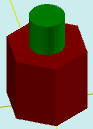

# solidAddDifColor

[Contents](contents.htm)=>[3D Script](script3d.md)=>[Building 3D models](script2Root.md)

---

## Call format
`faceList solidAddDifColor( faceList solid, flat profile, float height, float offset, color bodyColor )`

## Description
Adds an extension onto the last face of the shape using an arbitrary profile and with an arbitrary color for this extension.

The last face is typically the top one, but not always. For example, in a cup or a glass, it is the bottom of the inner surface.

## Parameters
- solid - original shape
- profile - profile of the extension (or the cup). The profile must not intersect with the profile of the last face; i.e., one profile must be completely inside the other
- height - height of the extension. Positive numbers create an extension, negative numbers create a cup-like hollow
- offset - offset of the extension's start (or the inner part of the cup) along the normal to the last surface
- bodyColor - color of the extension

## Usage example

```
body = solidPlygedronInner( 2, 4, 6, true )

b = flatCircle( 1 )

body = solidAddDifColor( body, b, 2, 0,  selectColor("#008000") )

partModel = modelSolid( selectColor("#800000"), body, 0,0,0, 0,0,0 )
```

This code generates the following image:



