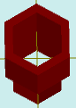

# solidAddHole

[Contents](contents.htm)=>[3D Script](script3d.md)=>[Building 3D models](script2Root.md)

---

## Call format
`faceList solidAddHole( faceList solid, float thickness, float depth )`

## Description
Adds a bottomless hole to the last face of the shape.

The last face is typically the top one, but not always. For example, in a cup or a glass, it is the bottom of the inner surface.

## Parameters
- solid - original shape
- thickness - distance from the profile of the last face to the profile of the hole. Positive numbers make the hole smaller than the last face, negative numbers make it larger
- depth - depth of the hole. Positive numbers create a hole, negative numbers create a protruding thin-walled tube

## Usage example

```
body = solidPlygedronInner( 2, 4, 6, false )

body = solidAddHole( body, 0.5, 8 )

partModel = modelSolid( selectColor("#800000"), body, 0,0,0, 0,0,0 )
```

This code generates the following image:



