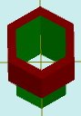

# solidAddHoleColor

[Содержание](contents.htm)=>[Скрипт 3d](script3d.md)=>[Построение 3d моделей](script2Root.md)

---

## Формат вызова
`faceList solidAddHoleColor( faceList solid, float thickness, float depth, color bodyColor )`

## Описание
Добавляет на последнюю грань фигуры отверстие без дна и с заданием цвета отверстия.

Последняя грань обычно верхняя, но далеко не всегда. Например, у стакана это дно внутренней
поверхности стакана.

## Параметры
- solid исходная фигура
- thickness расстояние от профиля последней грани до профиля отверстия. Положительные
числа делают отверстие меньше, чем последняя грань, отрицательные - больше
- depth глубина отверстия. С положительными числами получается отверстие, с 
отрицательными - торчащая тонкостенная трубка
- bodyColor цвет отверстия

## Пример использования

```
body = solidPlygedronInner( 2, 4, 6, false )

body = solidAddHoleColor( body, 0.5, 8,  selectColor("#008000") )

partModel = modelSolid( selectColor("#800000"), body, 0,0,0, 0,0,0 )
```

Этот код сформирует такое изображение:



