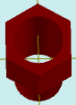

# solidAddHoleDif

[Содержание](contents.htm)=>[Скрипт 3d](script3d.md)=>[Построение 3d моделей](script2Root.md)

---

## Формат вызова
`faceList solidAddHoleDif( faceList solid, flat holeProfile, float depth )`

## Описание
Добавляет на последнюю грань фигуры отверстие с произвольным профилем без дна.

Последняя грань обычно верхняя, но далеко не всегда. Например, у стакана это дно внутренней
поверхности стакана.

## Параметры
- solid исходная фигура
- profile профиль отверстия. Профиль отверстия не должен пересекаться с профилем
последней грани, т.е.один профиль должен быть полностью внутри другого
- depth глубина отверстия. С положительными числами получается отверстие, с 
отрицательными - торчащая тонкостенная трубка

## Пример использования

```
body = solidPlygedronInner( 2, 4, 6, false )

hole = flatCircle( 1.5 )

body = solidAddHoleDif( body, hole, 8 )

partModel = modelSolid( selectColor("#800000"), body, 0,0,0, 0,0,0 )
```

Этот код сформирует такое изображение:



