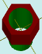

# solidAddHoleDifColor

[Contents](contents.htm)=>[3D Script](script3d.md)=>[Building 3D models](script2Root.md)

---

## Call format
`faceList solidAddHoleDifColor( faceList solid, flat holeProfile, float depth, color bodyColor )`

## Description
Adds a bottomless hole with an arbitrary profile and an arbitrary color to the last face of the shape.

The last face is typically the top one, but not always. For example, in a cup or a glass, it is the bottom of the inner surface.

## Parameters
- solid - original shape
- profile - profile of the hole. The hole profile must not intersect with the profile of the last face; i.e., one profile must be completely inside the other
- depth - depth of the hole. Positive numbers create a hole, negative numbers create a protruding thin-walled tube
- bodyColor - color of the extension

## Usage example

```
body = solidPlygedronInner( 2, 4, 6, false )

hole = flatCircle( 1.5 )

body = solidAddHoleDifColor( body, hole, 8, selectColor("#008000") )

partModel = modelSolid( selectColor("#800000"), body, 0,0,0, 0,0,0 )
```

This code generates the following image:



