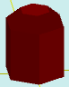

# solidAddRoofBevel

[Contents](contents.htm)=>[3D Script](script3d.md)=>[Building 3D models](script2Root.md)

---

## Call format
`faceList solidAddRoofBevel( faceList solid, float bevelSize )`

## Description
Adds a roof with a bevel (chamfer) to the last face of the shape.

The last face is typically the top one, but not always. For example, in a cup or a glass, it is the bottom of the inner surface.

## Parameters
- solid - original shape
- bevelSize - size of the bevel. If positive, the roof size is smaller than the last face of the shape; if negative, it is larger.

## Usage example

```
body = solidPlygedronInner( 2, 4, 6, true )

body = solidAddRoofBevel( body, 1 )

partModel = modelSolid( selectColor("#800000"), body, 0,0,0, 0,0,0 )
```

This code generates the following image:



