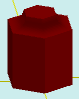

# solidAddRoofRound

[Содержание](contents.htm)=>[Скрипт 3d](script3d.md)=>[Построение 3d моделей](script2Root.md)

---

## Формат вызова
`faceList solidAddRoofRound( faceList solid, float roundRadius, bool great )`

## Описание
Добавляет на последнюю грань фигуры крышу с закругленными гранями. Возможны 4 комбинации
крыши в зависимости от знака радиуса и значения флага great.

Последняя грань обычно верхняя, но далеко не всегда. Например, у стакана это дно внутренней
поверхности стакана.

## Параметры
- solid исходная фигура
- roundRadius радиус скругления. Если положительное, то формируется выпуклое скругление,
если отрицательное, то формируется вогнутое скругление
- great если true, то поверхность крыши больше последней грани фигуры, если 
false - то меньше


## Пример использования

```
body = solidPlygedronInner( 2, 4, 6, true )

body = solidAddRoofRound( body, -1, false )

partModel = modelSolid( selectColor("#800000"), body, 0,0,0, 0,0,0 )
```

Этот код сформирует такое изображение:



