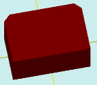

# solidBoxBevel

[Содержание](contents.htm)=>[Скрипт 3d](script3d.md)=>[Построение 3d моделей](script2Root.md)

---

## Формат вызова
`faceList solidBoxBevel( float lenght, float width, float height, float bevelSize, float bevelCount, bool addBottom )`

## Описание
Строит параллелепипед. На вертикальные ребра добавляется фаска.

## Параметры
- lenght - длина основания (X)
- width - ширина основания (Y)
- height - высота
- bevelSize - размер фаски
- bevelCount - количество ребер с фасками (1-4)
- addBottom - когда true добавляется нижняя грань, в противном случае - не добавляется

## Пример использования

```
body = solidBoxBevel( 6, 4, 3, 0.5, 2, true )

partModel = modelSolid( selectColor("#800000"), body, 0,0,0, 0,0,0 )
```

Этот код сформирует такое изображение:


