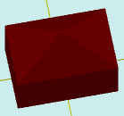

# solidBoxWithCone

[Contents](contents.htm)=>[3D Script](script3d.md)=>[Building 3D models](script2Root.md)

---

## Call format
`faceList solidBoxWithCone( float lenght, float width, float height, float coneHeight, bool addBottom )`

## Description
Constructs a parallelepiped (box) with a conical roof.

## Parameters
- lenght - base length (X)
- width - base width (Y)
- height - height
- coneHeight - height of the conical roof. Positive numbers form a roof, negative numbers form a depression
- addBottom - when true, the bottom face is added; otherwise, it is omitted

## Usage example

```
body = solidBoxWithCone( 6, 4, 3, 2, true )

partModel = modelSolid( selectColor("#800000"), body, 0,0,0, 0,0,0 )
```

This code generates the following image:


