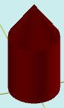

# solidCylinderWithCone

[Contents](contents.htm)=>[3D Script](script3d.md)=>[Building 3D models](script2Root.md)

---

## Call format
`faceList solidCylinderWithCone( float radius, float height, float coneHeight, bool addBottom )`

## Description
Constructs a cylinder with a cone on top.

## Parameters
- radius - base radius
- height - height of the cylinder
- coneHeight - height of the cone. If the number is positive, a roof is built; if negative, a depression is built
- addBottom - when true, the bottom face is added; otherwise, it is omitted

## Usage example

```
body = solidCylinderWithCone( 2, 5, 3, true )

partModel = modelSolid( selectColor("#800000"), body, 0,0,0, 0,0,0 )
```

This code generates the following image:


