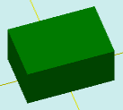

# solidNewColor

[Contents](contents.htm)=>[3D Script](script3d.md)=>[Building 3D models](script2Root.md)

---

## Call format
`faceList solidNewColor( flat profile, float height, bool addBottom, color bodyColor )`

## Description
Constructs a prism with a base specified by a contour.

## Parameters
- profile - a convex base contour generated by one of the flatXXX functions
- height - height of the prism
- addBottom - when true, the bottom face is added; otherwise, it is omitted
- bodyColor - color of the prism faces

## Usage example


```
f = flatRectangle( 6, 4 )

body = solidNewColor( f, 3, true, selectColor("#008000") )

partModel = modelSolid( selectColor("#800000"), body, 0,0,0, 0,0,0 )
```

This code generates the following image:



Here, the green color specified in the `solidNewColor` function overrides
the color specified during model creation.
