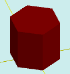

# solidPlygedronOuter

[Содержание](contents.htm)=>[Скрипт 3d](script3d.md)=>[Построение 3d моделей](script2Root.md)

---

## Формат вызова
`faceList solidPlygedronOuter( float radius, float height, float sideCount, bool addBottom )`

## Описание
Строит призму с основанием в виде правильного многоугольника, сформированного по описанной
окружности.

## Параметры
- radius - радиус окружности, описанной вокруг многоугольника основания призмы
- height - высота призмы
- sideCount - количество сторон многоугольника основания
- addBottom - когда true добавляется нижняя грань, в противном случае - не добавляется

## Пример использования

```
body = solidPlygedronOuter( 2, 4, 6, true )

partModel = modelSolid( selectColor("#800000"), body, 0,0,0, 0,0,0 )
```

Этот код сформирует такое изображение:


