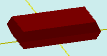

# solidRectPrizm

[Contents](contents.htm)=>[3D Script](script3d.md)=>[Building 3D models](script2Root.md)

---

## Call format
`faceList solidRectPrizm( float lenght, float width, floatList floors[lenght, width, offx, offy, height...], bool addBottom )`

## Description
Constructs a prism with a rectangular base and multiple floors that also have a rectangular profile. The dimensions and position of each floor can be customized, which allows building objects like transformer coils or microchip packages.

## Parameters
- lenght - base length
- width - base width
- floors - an array of numbers, where each group of five numbers describes one floor
- addBottom - when true, the bottom face is added; otherwise, it is omitted

### Floor description
- lenght - length of the floor rectangle
- width - width of the floor rectangle
- offx - offset of the floor center along the X axis
- offy - offset of the floor center along the Y axis
- height - height of the floor

## Usage example

```
body = solidRectPrizm( 4, 2, [ 4.4, 2.4, 0, 0, 0.5,
                               4,   2,   0,  0, 0.5], true )

partModel = modelSolid( selectColor("#800000"), body, 0,0,0, 0,0,0 )
```

This code generates the following image:


