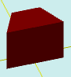

# solidTrapezoid

[Contents](contents.htm)=>[3D Script](script3d.md)=>[Building 3D models](script2Root.md)

---

## Call format
`faceList solidTrapezoid( float lenghtTop, float lenghtBot, float width, float height, bool addBottom )`

## Description
Constructs a prism with a trapezoid base.

## Parameters
- lenghtTop - length of the top base of the trapezoid
- lenghtBot - length of the bottom base of the trapezoid
- width - height of the trapezoid
- height - height of the prism
- addBottom - when true, the bottom face is added; otherwise, it is omitted

## Usage example

```
body = solidTrapezoid( 2, 4, 2, 3, true )

partModel = modelSolid( selectColor("#800000"), body, 0,0,0, 0,0,0 )
```

This code generates the following image:


