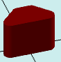

# solidTrapezoidRound

[Содержание](contents.htm)=>[Скрипт 3d](script3d.md)=>[Построение 3d моделей](script2Root.md)

---

## Формат вызова
`faceList solidTrapezoidRound( float lenghtTop, float lenghtBot, float width, float height, float roundRadius, bool addBottom )`

## Описание
Строит призму с основанием в виде трапеции с закругленными углами.

## Параметры
- lenghtTop - длина верхнего основания трапеции
- lenghtBot - длина нижнего основания трапеции
- width - высота трапеции (ширина призмы)
- height - высота призмы
- roundRadius - радиус скругления углов
- addBottom - когда true добавляется нижняя грань, в противном случае - не добавляется

## Пример использования

```
body = solidTrapezoidRound( 2, 4, 2, 3, 0.3, true )

partModel = modelSolid( selectColor("#800000"), body, 0,0,0, 0,0,0 )
```

Этот код сформирует такое изображение:


