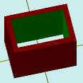

# solidTubeColor

[Contents](contents.htm)=>[3D Script](script3d.md)=>[Building 3D models](script2Root.md)

---

## Call format
`faceList solidTubeColor( flat outProfile, float thickness, float height, bool addBottom, color bodyColor )`

## Description
Constructs a tube with a specified profile and wall thickness.

## Parameters
- outProfile - a convex contour of the outer tube surface generated by one of the flatXXX functions
- thickness - wall thickness of the tube
- height - height of the tube
- addBottom - when true, the bottom face is added; otherwise, it is omitted
- bodyColor - color of the inner surface of the tube

## Usage example

```
f = flatRectangle( 6, 4 )

body = solidTubeColor( f, 0.5, 5, true,  selectColor("#008000") )

partModel = modelSolid( selectColor("#800000"), body, 0,0,0, 0,0,0 )
```

This code generates the following image:



