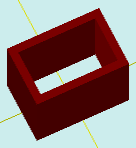

# solidTubeColor

[Содержание](contents.htm)=>[Скрипт 3d](script3d.md)=>[Построение 3d моделей](script2Root.md)

---

## Формат вызова
`faceList solidTubeColor( flat outProfile, float thickness, float height, bool addBottom, color bodyColor )`

## Описание
Строит трубу с заданным профилем и толщиной стенки.

## Параметры
- outProfile - выпуклый контур внешней поверхности трубы, формируемый одной из функций flatXXX
- thickness - толщина стенки трубы
- height - высота трубы
- addBottom - когда true добавляется нижняя грань, в противном случае - не добавляется
- bodyColor - цвет внутренней поверхности трубы

## Пример использования

```
f = flatRectangle( 6, 4 )

body = solidTubeColor( f, 0.5, 5, true,  selectColor("#008000") )

partModel = modelSolid( selectColor("#800000"), body, 0,0,0, 0,0,0 )
```

Этот код сформирует такое изображение:



