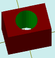

# solidTubeDifColor

[Contents](contents.htm)=>[3D Script](script3d.md)=>[Building 3D models](script2Root.md)

---

## Call format
`faceList solidTubeDifColor( flat outProfile, flat inProfile, float height, bool addBottom, color bodyColor )`

## Description
Constructs a tube with specified outer and inner profiles, which can be different in the general case. The color of the inner surface of the tube is specified.

## Parameters
- outProfile - a convex contour of the outer tube surface generated by one of the flatXXX functions
- inProfile - a convex contour of the inner tube surface generated by one of the flatXXX functions; the inner profile must be strictly inside the outer one
- height - height of the tube
- addBottom - when true, the bottom face is added; otherwise, it is omitted
- bodyColor - color of the inner surface of the tube

## Usage example

```
f = flatRectangle( 6, 4 )
i = flatCircle( 1.5 )

body = solidTubeDifColor( f, i, 5, true,  selectColor("#008000") )

partModel = modelSolid( selectColor("#800000"), body, 0,0,0, 0,0,0 )
```

This code generates the following image:



